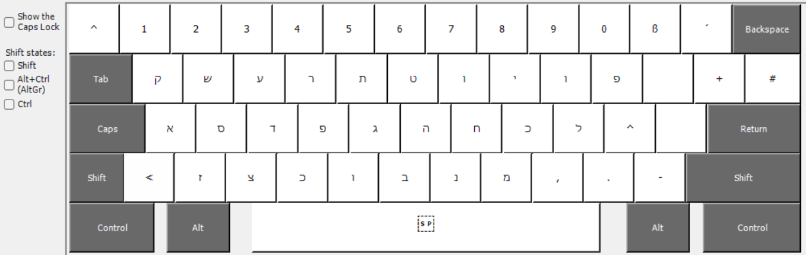
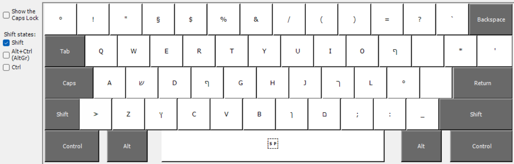
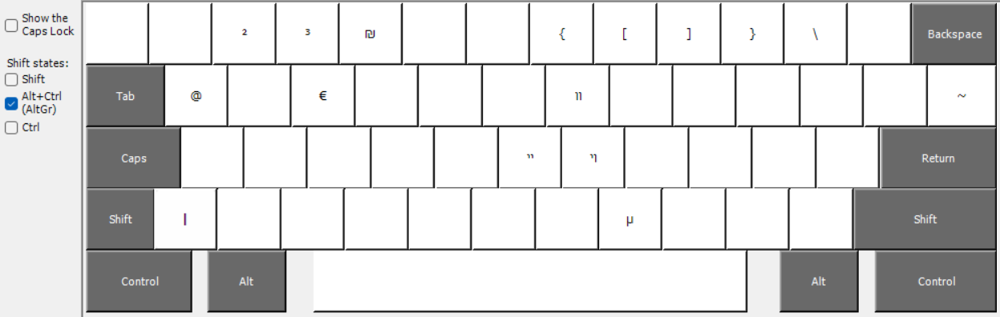
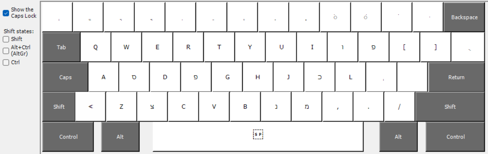

# he-de
Hebrew &amp; German Keyboard Crossover for Windows 

Das Lernen von hebräisch ist so schon nicht ganz einfach, zu den neuen Zeichen und der ungewohnten Schreibrichtung von rechts nach links kommen Nikkuds und Varianten wie Sofits. Das Schreiben auf einem Computer ist dann nochmal ein Stück schwerer, da die Zeichen in Windows immer eine Taste neben der phonetisch logischen ist.

Ich habe mir das phonetische hebräische Layout von Jake Binstein herunterladen und im Microsoft Keyboard Layout Creator so umgebaut, dass es für die deutsche Tastatur phonetisch passt. Unsere Sonderzeichen wir das @ mit Alt-Gr + Q wurde übernommen.

Screenshots der 4 Layer:

Standard Layer

Shift Layer

Alt-Gr Layer

Caps/Nikkud Layer

